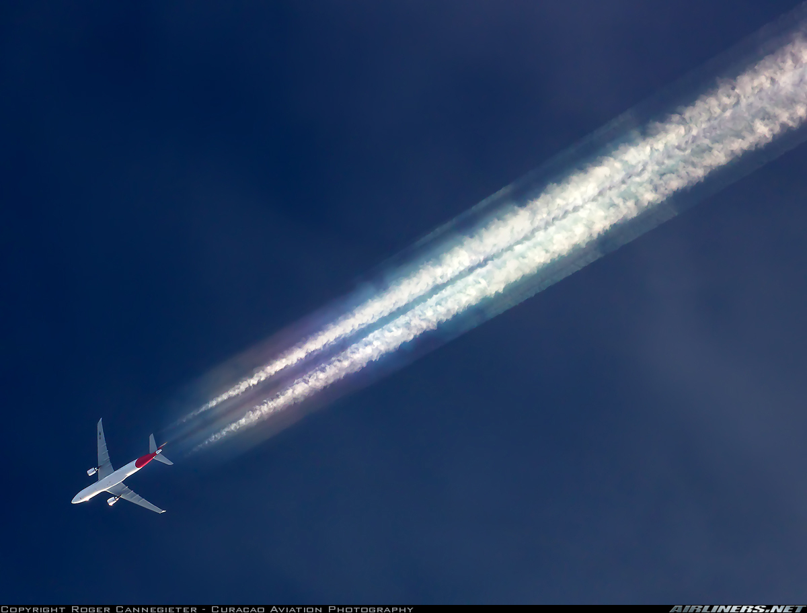

# Aircraft datasets
## [CosmiqWorks](https://www.cosmiqworks.org/) *RarePlanes* dataset

[project](https://www.cosmiqworks.org/RarePlanes/), [paper](https://arxiv.org/abs/2006.02963), [data](https://www.cosmiqworks.org/rareplanes-public-user-guide/)

### Summary
Overhead imagery of aircraft combining real and synthetic data from airports aroud the world, labeled hierarchically. Contains about 50,000 images and 630,000 bounding box annotations.

### Annotations
- Bounding boxes
- Segmentation masks for synthetic images
- [Hierarchical labels](https://www.cosmiqworks.org/wp-content/uploads/2020/05/rareplanes-features.jpg)

### Samples

## [FGVC (fine-grained visual classification) Aircraft Benchmark](https://www.robots.ox.ac.uk/~vgg/data/fgvc-aircraft/)

[project](https://www.robots.ox.ac.uk/~vgg/data/fgvc-aircraft/), [paper](https://arxiv.org/abs/1306.5151), [data](https://www.robots.ox.ac.uk/~vgg/data/fgvc-aircraft/archives/fgvc-aircraft-2013b.tar.gz)

### Summary

Benchmark dataset for the fine grained visual categorization of aircraft.

This dataset contains 10,200 images of aircraft, with 100 images for each of 102 different aircraft model variants, most of which are airplanes. The main aircraft in each image is annotated with a tight bounding box and a hierarchical airplane model label. Images are from [airliners.net](www.airliners.net) ([more info](#airlinersnet)).

### Annotations
- Bounding boxes
- Hierarchical aircraft labels (model variant, family, and manufacturer)

### Sample Images

## Military Aircraft Detection Dataset
[project](https://www.kaggle.com/datasets/a2015003713/militaryaircraftdetectiondataset), 
[data](https://www.kaggle.com/datasets/a2015003713/militaryaircraftdetectiondataset/download)

### Summary
6178 images of 40 types of military aircraft, from a wide variety of viewing perspectives and environments.

In addition to images with bounding boxes, the dataset also includes extracted crops of each aircraft, organized by aircraft type.

### Annotations
- Bounding box in PASCAL VOC format (xmin, ymin, xmax, ymax)
- Aircraft type (A10, A400M, AG600, AV8B, B1, B2, B52 Be200, C130, C17, C5, E2, EF2000, F117, F14, F15, F16, F18, F22, F35, F4, J20, JAS39, MQ9, Mig31, Mirage2000, RQ4, Rafale, SR71/A12, Su34, Su57, Tornado, Tu160, Tu95/Tu142, U2, US2, V22, Vulcan, XB70, YF23)

### Sample Images

https://pan.baidu.com/s/11UORs4eaKKPZNscIrtbISg

## Military Aircraft Detection in Aerial Images (MADAI)

[project](https://github.com/wangyanfeng231/TransEffiDet), [paper](https://www.hindawi.com/journals/cin/2022/2262549/) ([pdf](https://downloads.hindawi.com/journals/cin/2022/2262549.pdf)), [data](https://pan.baidu.com/s/11UORs4eaKKPZNscIrtbISg) (on Baidu)

### Summary
This dataset contains 2558 images of military aircraft, labeled as one of five categories (Fighter jets, armed helicopters, bombers, early warning aircraft, and passenger aircraft). 

### Annotations
- Bounding boxes
- Class labels

### Samples

## Airliners.net
[website](https://www.airliners.net/)

### Summary
In addition to the curated datasets above, the website [www.airliners.net](http://www.airliners.net) hosts lots of images of aircraft, often including assiciated metadata. The images are sortable by multiple criteria including affiliation (military; nonmilitary), type (passenger; single-engine prop; helicopter), view (air-to-air; creative night/dusk/dawn), and others. The [FGVC dataset](#fgvc-fine-grained-visual-classification-aircraft-benchmark) images are apparently derived from this website, and the broader database itself may be useful to produce other custom datasets.

### Samples
The following images were selected by searching [www.airliners.net](www.airliners.net) for the keyword ["contrail"](https://www.airliners.net/search?keywords=contrail).

